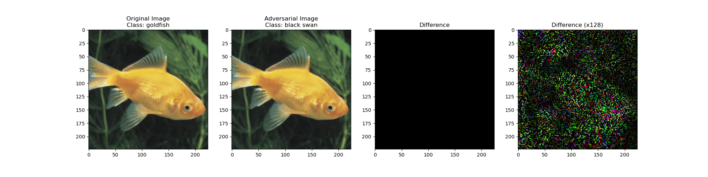

## Overview
This README provides instructions for running both **targeted** and **untargeted** attacks using **FGSM** and **PGD**, constrained by **L-infinity** and **L2** norms. Commands for each attack type are included, along with options for specifying parameters such as epsilon, target class, and maximum iterations.

### Models and Datasets
The attacks are performed on the **ResNet-50** model trained on the **ImageNet** dataset. The pretrained model is loaded using **PyTorch**'s `torchvision` library. 

### Usage

The following commands demonstrate how to run the attacks:

---

### Untargeted FGSM Attacks

Run **FGSM** attacks without specifying a target class:

#### L-infinity Norm
```bash
python main.py --image_path images/n01443537_goldfish.jpeg --atk_type fgsm_linf --epsilon 0.03
```

#### L2 Norm
```bash
python main.py --image_path images/n01443537_goldfish.jpeg --atk_type fgsm_l2 --epsilon 1.0
```

---

### Untargeted PGD Attacks

Run **PGD** attacks without specifying a target class:

#### L-infinity Norm
```bash
python main.py --image_path images/n01443537_goldfish.jpeg --atk_type pgd_linf --epsilon 0.03 --max_iterations 10
```

#### L2 Norm
```bash
python main.py --image_path images/n01443537_goldfish.jpeg --atk_type pgd_l2 --epsilon 1.0 --max_iterations 10
```

---

### Targeted FGSM Attacks

Run **FGSM** attacks with a specified target class (e.g., class `100`):

#### L-infinity Norm
```bash
python main.py --image_path images/n01443537_goldfish.jpeg --atk_type fgsm_linf --epsilon 0.03 --target 100
```

#### L2 Norm
```bash
python main.py --image_path images/n01443537_goldfish.jpeg --atk_type fgsm_l2 --epsilon 1.0 --target 100
```

---

### Targeted PGD Attacks

Run **PGD** attacks with a specified target class (e.g., class `100`):

#### L-infinity Norm
```bash
python main.py --image_path images/n01443537_goldfish.jpeg --atk_type pgd_linf --epsilon 0.03 --max_iterations 10 --target 100
```

#### L2 Norm
```bash
python main.py --image_path images/n01443537_goldfish.jpeg --atk_type pgd_l2 --epsilon 1.0 --max_iterations 10 --target 100
```

---

### Script Options

Alternatively, you can run the script which has all the above commands:

```bash
bash run.sh
```

### Parameters

- **`--image_path`**: Path to the input image file.
- **`--atk_type`**: Type of attack (`fgsm_linf`, `fgsm_l2`, `pgd_linf`, `pgd_l2`). Default is `pgd_linf`.
- **`--epsilon`**: Perturbation constraint (e.g., 0.03 for L-infinity, 1.0 for L2).
- **`--max_iterations`**: Number of iterations for PGD (default: 10).
- **`--target`**: Target class for targeted attacks (e.g., `100`). If not specified, the attack is untargeted i.e causes misclassification from the original class.

---

### Results

The resultant adversarial image and the corresponding class probabilities are displayed after running the attack. The original image, adversarial image, and differences are saved in the `adversarial_images` directory.



### Notes

- For targeted attacks, the `--target` parameter specifies the desired class.
- Adjust `epsilon` and `max_iterations` based on `--atk_type` for best results.

### Future Work
- Need to tune the hyperparameters for better results. Possibly make it more adaptive.